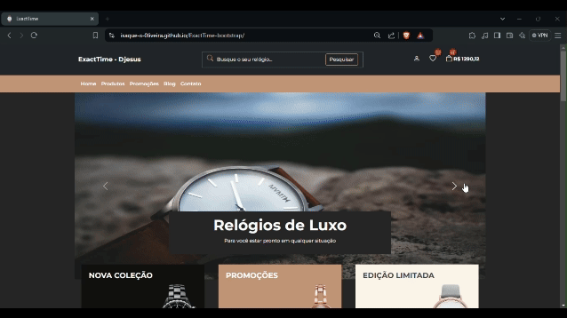

# ExactTime    
### Veja a aplicação funcionando <a title="https://isaque-s-0liveira.github.io/ExactTime-bootstrap/" role="link" target="_blank" rel="noopener noreferrer nofollow" class="text-bold" href="https://isaque-s-0liveira.github.io/ExactTime-bootstrap/">clicando aqui</a>

## Contexto

Este projeto tem como objetivo principal praticar e consolidar o uso de Bootstrap, CSS, HTML e princípios de web design responsivo. O ExactTime é uma aplicação de e-commerce focada na venda de relógios, apresentando uma interface totalmente estática e otimizada para diversos dispositivos.

  
Veja o preview da aplicação clicando aqui

  

  
  

## Técnologias usadas

- [HTML](https://developer.mozilla.org/pt-BR/docs/Web/HTML)
- [CSS](https://developer.mozilla.org/pt-BR/docs/Web/CSS)
- [Bootstrap](https://getbootstrap.com/)

## Entre em contato:

